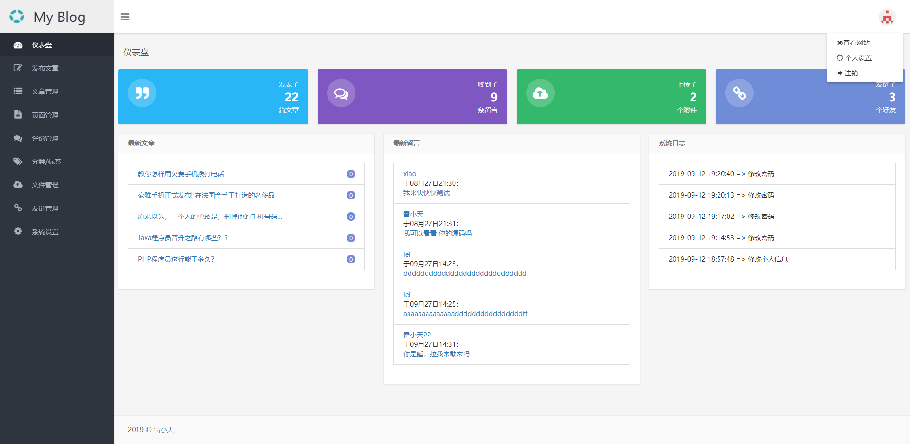

# SpringBoot博客项目
👉SpringBoot项目是[雷小天](https://www.100txy.com)开发一个Java博客项目，由 Sprinboot+shiro+mybatis+freemarker+redis等技术实现。本人主要从事PHP开发工作，由于对Java特别感兴趣，也抱着一个学习热爱Java的心态做了这个springboot开源项目，有很多地方做的不是很完善，后续也将慢慢完善。如果大家感兴趣可以点个star支持下！

### 开发文档  
* 注意事项
 1. 运行项目前请确认安装好了mysql和redis 
 2. Linux登录MySQL时，出现Access denied for user 'root'@'localhost' (using password: YES) 拒绝访问  
    i.出现这个问题是由于没有设置过密码造成拒绝访问，解决办法如下：  
    ii.修改vim /etc/my.cnf配置文件(my.ini是windows)，先新增`skip-grant-tables`跳过密码验证，再重启MySQL`systemctl restart mysqld.service`    
    iii.Mysql密码设置步骤  
         1.登入Linux`输入mysql -u root -p`回车出现password不用输入密码直接回车进入  
         2.进入mysql数据库`输入：mysql> use MySQL`  
         3.更改密码：`输入：mysql>update user set authentication_string=password(“这里是你想重置的密码”) where user=“root”;`  
         4.刷新数据库`输入：mysql> flush privileges`  
         5.退出mysql`输入： mysql>exit`  
         6.修改完root密码后，将my.cnf文件添加的`skip-grant-tables`删除，保存重启mysql服务就可以通过密码登陆mysql了  
         7.试一下把！`mysql>mysql -u root -p`  
         
 3. MySql数据库文件导入  
    3.1.新增数据库`CREATE DATABASE `springboot` DEFAULT CHARACTER SET utf8 COLLATE utf8_general_ci`  
    3.2.选择数据库，先查看数据库是否创建成功`use 数据库名;`，再选中`use 数据库名;`  
    3.3.导入springboot.sql文件`source /data/wwwroot/springboot.sql`注意：source命令后面不要加 分号  
 4. linux安装redis 完整步骤  
    4.1.获取redis资源`wget http://download.redis.io/releases/redis-4.0.8.tar.gz`  
    4.2.解压`tar xzvf redis-4.0.8.tar.gz`  
    4.3.安装  
    　　`cd redis-4.0.8`  
    　　`make`  
    　　`cd src`  
    　　`make install PREFIX=/usr/local/redis`  
    4.4.移动配置文件到安装目录下  
    　　`cd ../`  
    　　`mkdir /usr/local/redis/etc`  
    　　`mv redis.conf /usr/local/redis/etc`  
    4.5.配置redis为后台启动  
    　　`vi /usr/local/redis/etc/redis.conf //将daemonize no 改成daemonize yes`  
    4.6.将redis加入到开机启动  
    　　`vi /etc/rc.local //在里面添加内容：/usr/local/redis/bin/redis-server /usr/local/redis/etc/redis.conf (意思就是开机调用这段开启redis的命令)`  
    4.7.开启redis  
    　　`/usr/local/redis/bin/redis-server /usr/local/redis/etc/redis.conf`   
    4.8.常用命令  
    　　`redis-server /usr/local/redis/etc/redis.conf //启动redis`  
    　　`pkill redis  //停止redis`  
    　　卸载redis：  
    　　　　`rm -rf /usr/local/redis //删除安装目录`  
    　　　　`rm -rf /usr/bin/redis-* //删除所有redis相关命令脚本`  
    　　　　`rm -rf /root/download/redis-4.0.4 //删除redis解压文件夹`  
 
### 项目部署  
 * ##### jar方式部署  [详情](https://www.100txy.com/article/247.html)  
 * ##### docker方式部署  
 
### 学习笔记  
* springboot启动方式
 1. @EnableAutoConfiguration 注解作用：扫包范围 默认在当前类里面（注解在类上面） 
 2. 启动 加上扫包范围注解@ComponentScan(cn.lxtkj.springboot.controller),如果是多个时@ComponentScan(basePackages = {"cn.lxtkj.springboot.controller","cn.lxtkj.springboot.dao"})不建议这种方式，建议使用@SpringBootApplication
 3. @SpringBootApplication等同@EnableAutoConfiguration + @ComponentScan同级包（SpringBootApplication同级包为：cn.lxtkj.springboot）和当前包，所以启动类一般放最外面
 
 ### 开发记录
 * ##### 整合freemarker
 * ##### 整合全局捕获异常
    ###### 全局捕获异常，使用AOP技术，采用异常通知
 * ##### 整合mybatis
 * ##### @Transactional事务注解（当报错会回滚，保持事务的一致性）
 * ##### 整合jpa
 * ##### SpringBoot整合多数据源
 * ##### SpringBoot项目打包
    1. ###### 使用命令 mvn clean package 打包（mvn packsge Dmven.test.skip=true/ mvn -Dmaven.test.skip -U clean package   //跳过测试类）
    2. ###### 使用idea Maven Projects > 项目名 > Lifecycle > 双击package开始打包
 * ##### SpringBootActuator监控接口  
 * ##### 项目后台及前台功能开发及完善  
 * ##### shiro权限功能完善  
 * ##### 项目redis缓存功能完善  
 
 ### 项目来源  
 * [小额捐赠](https://www.100txy.com/Home/Index/alidonate.html)    
 * [作者博客](http://100txy.com)    
 * 微信公号  
   
 
 